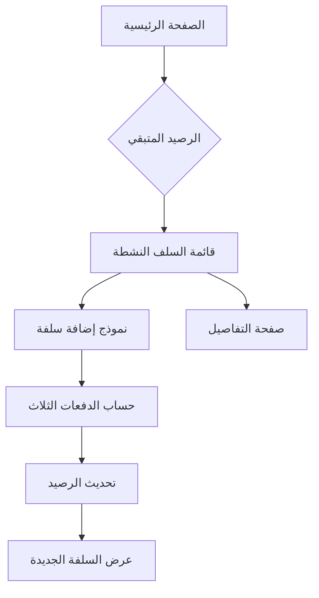

# Ohda Manager - Product Requirements Document

## 1. نظرة عامة على المنتج
نظام إدارة العُهد (السلف) للموظفين يسمح بمنح سلف مالية من رصيد ثابت قدره 15,000 درهم إماراتي مع نظام سداد على 3 دفعات شهرية متساوية.

المنتج يحل مشكلة تتبع السلف وإدارتها بشكل منظم مع إمكانية معرفة الرصيد المتبقي والدفعات المستحقة.

## 2. الميزات الأساسية

### 2.1 أدوار المستخدمين
| الدور | طريقة التسجيل | الصلاحيات الأساسية |
|------|----------------|------------------|
| المدير | تسجيل دخول واحد مسبق | إضافة سلف، عرض التقارير، إدارة الرصيد |
| الموظف | لا يوجد تسجيل | عرض سلفه فقط (بدون تسجيل) |

### 2.2 وحدات الميزات
المتطلبات الأساسية للنظام تتكون من الصفحات التالية:
1. **الصفحة الرئيسية**: عرض الرصيد المتبقي، قائمة السلف النشطة، نموذج إضافة سلفة جديدة.
2. **صفحة التفاصيل**: عرض تفاصيل السلفة والدفعات المستحقة.

### 2.3 تفاصيل الصفحات
| اسم الصفحة | اسم الوحدة | وصف الميزة |
|-----------|------------|------------|
| الصفحة الرئيسية | قسم الرصيد | عرض الرصيد المتبقي من العهدة (15,000 - مجموع السلف) |
| الصفحة الرئيسية | قائمة السلف | جدول يعرض جميع السلف النشطة مع اسم الموظف والمبلغ وتاريخ الإضافة |
| الصفحة الرئيسية | نموذج إضافة سلفة | حقول إدخال: اسم الموظف، مبلغ السلفة، زر إضافة |
| الصفحة الرئيسية | معلومات الدفعات | عرض المبلغ المستحق شهرياً لكل سلفة (المبلغ الكلي ÷ 3) |
| صفحة التفاصيل | تفاصيل السلفة | عرض تفاصيل كاملة: اسم الموظف، المبلغ، الدفعات الثلاث مع حالتها |

## 3. العمليات الأساسية

### تدفق عمل المدير:
1. فتح الصفحة الرئيسية
2. عرض الرصيد المتبقي
3. مراجعة السلف النشطة
4. إضافة سلفة جديدة (إدخال اسم الموظف والمبلغ)
5. تأكيد الخصم من الرصيد وعرض الدفعات

## 4. تصميم واجهة المستخدم

### 4.1 نمط التصميم
- الألوان الأساسية: الأزرق الداكن (#1e40af) والأبيض
- الألوان الثانوية: الأخضر (#10b981) للإيجابيات، الأحمر (#ef4444) للسلبيات
- نمط الأزرار: أزرار مستديرة الحواف مع ظلال خفيفة
- الخط: Tajawal أو Arial مع الأحجار 14px للنص، 18px للعناوين
- نمط التخطيط: بطاقات (Cards) مع فواصل واضحة
- الأيقونات: استخدام رموز Unicode أو أيقونات بسيطة

### 4.2 نظرة عامة على تصميم الصفحات
| اسم الصفحة | اسم الوحدة | عناصر واجهة المستخدم |
|-----------|------------|----------------------|
| الصفحة الرئيسية | قسم الرصيد | بطاقة كبيرة بخلفية زرقاء، خط عريض، رقم الرصيد بخط كبير |
| الصفحة الرئيسية | قائمة السلف | جدول بسيط مع خطوط أفقية، أعمدة: الاسم، المبلغ، الدفعة الشهرية، التاريخ |
| الصفحة الرئيسية | نموذج إضافة سلفة | حقلين للإدخال مع labels واضحة، زر إضافة باللون الأخضر |
| صفحة التفاصيل | تفاصيل السلفة | بطاقات منفصلة لكل دفعة مع حالة الاستحقاق |

### 4.3 التجاوبية
- التصميم الأساسي للكمبيوتر المكتبي
- التكيف مع الشاشات الصغيرة (الموبايل) من خلال تكديس العناصر عمودياً
- حجم الخطوط يتكافق مع الشاشات المختلفة

## 5. المتطلبات التقنية
- لا يتطلب تسجيل دخول معقد
- حفظ البيانات محلياً في المتصفح (LocalStorage)
- إمكانية تصدير البيانات كملف CSV
- تصميم بسيط وسهل الاستخدام