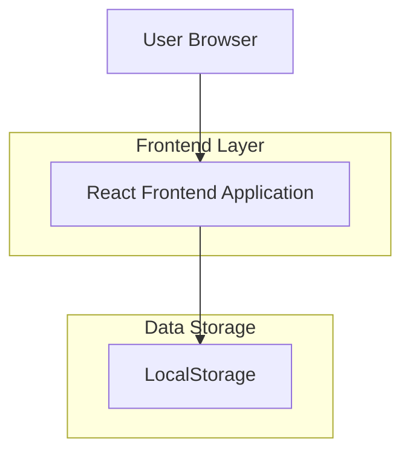

# Ohda Manager - Technical Architecture Document

## 1. تصميم البنية



## 2. وصف التقنيات
- Frontend: React@18 + tailwindcss@3 + vite
- أداة التهيئة: vite-init
- Backend: لا يوجد (تطبيق frontend فقط)
- قاعدة البيانات: LocalStorage (مخزن محلي في المتصفح)

## 3. تعريف المسارات
| المسار | الغرض |
|-------|--------|
| / | الصفحة الرئيسية، عرض الرصيد وقائمة السلف |
| /loan/:id | صفحة تفاصيل السلفة ودفعاتها |

## 4. نموذج البيانات

### 4.1 هيكل البيانات في LocalStorage
```typescript
interface Loan {
  id: string;
  employeeName: string;
  amount: number;
  monthlyPayment: number;
  remainingBalance: number;
  createdAt: string;
  payments: Payment[];
}

interface Payment {
  id: string;
  amount: number;
  dueDate: string;
  status: 'pending' | 'paid';
  paidAt?: string;
}

interface AppData {
  totalFund: number;
  remainingFund: number;
  loans: Loan[];
}
```

### 4.2 العمليات الحسابية
- حساب الدفعة الشهرية: `المبلغ ÷ 3`
- تحديث الرصيد المتبقي: `الرصيد السابق - مبلغ السلفة`
- حساب الرصيد بعد السداد: `الرصيد الحالي + مبلغ الدفعة`

## 5. المكونات الأساسية

### 5.1 مكونات React
- `App`: المكون الرئيسي
- `Dashboard`: عرض الرصيد والسلف
- `LoanForm`: نموذج إضافة سلفة جديدة
- `LoansTable`: جديلة عرض السلف
- `LoanDetails`: تفاصيل السلفة والدفعات

### 5.2 دوال المساعدة
- `calculateMonthlyPayment(amount: number): number`
- `updateRemainingFund(loanAmount: number): number`
- `generatePayments(loan: Loan): Payment[]`
- `saveToLocalStorage(data: AppData): void`
- `loadFromLocalStorage(): AppData`

## 6. التخزين المحلي

### 6.1 مفتاح LocalStorage
- المفتاح: `ohdaManagerData`
- البنية الافتراضية:
```json
{
  "totalFund": 15000,
  "remainingFund": 15000,
  "loans": []
}
```

### 6.2 العمليات الأساسية
- عند إضافة سلفة جديدة:
  1. خصم المبلغ من الرصيد المتبقي
  2. إنشاء كائن السلفة مع الدفعات الثلاث
  3. حفظ البيانات في LocalStorage

- عند سداد دفعة:
  1. تحديث حالة الدفعة إلى 'paid'
  2. إضافة المبلغ إلى الرصيد المتبقي
  3. تحديث البيانات في LocalStorage

## 7. التصميم والتنسيق
- استخدام Tailwind CSS للتنسيق
- تصميم نظيف وبسيط
- ألوان متناسقة (الأزرق والأخضر والأحمر)
- تفاعلية بسيطة مع hover effects

## 8. المميزات الإضافية
- إمكانية تصدير البيانات كـ CSV
- تنبيهات بصرية عند الإضافة أو السداد
- حساب تلقائي للتواريخ المستحقة
- عرض الإحصائيات العامة